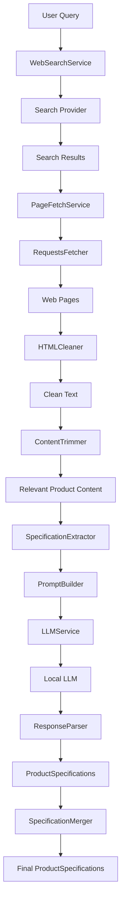

# Smart Query Search (SQS)

A modular AI-powered backend that discovers product information from the web, extracts structured specifications using a local LLM, and merges information from multiple sources into a single reliable product profile.

---

# Architecture

```text
                        ProductPipeline
                               │
        ┌──────────────────────┼──────────────────────┐
        │                      │                      │
        ▼                      ▼                      ▼
 WebSearchService      PageFetchService        HTMLCleaner
        │                      │
        ▼                      ▼
 SearchProvider          RequestsFetcher
        │                      │
        ▼                      ▼
  SearchResult[]          WebPage[]
                               │
                               ▼
                        Clean HTML Text
                               │
                               ▼
                        ContentTrimmer
                               │
                               ▼
                         Relevant Text
                               │
                               ▼
                  SpecificationExtractor
                    ├── PromptBuilder
                    ├── LLMService
                    └── ResponseParser
                               │
                               ▼
                 ProductSpecifications[]
                               │
                               ▼
                  SpecificationMerger
                               │
                               ▼
                Final ProductSpecifications
```

---

# Pipeline Flow



---

# Project Structure

```text
backend/
│
├── pipeline/
│   └── product_pipeline.py
│
├── services/
│   ├── search/
│   ├── fetch/
│   ├── cleaner/
│   ├── trimmer/
│   ├── extraction/
│   └── llm_service.py
│
├── models/
│
├── tests/
│
└── routes/
```

---

# Service Responsibilities

## ProductPipeline

Coordinates the complete workflow.

Responsibilities:

* Search the web
* Fetch webpages
* Clean HTML
* Trim irrelevant content
* Extract structured specifications
* Merge information from multiple pages

The pipeline contains orchestration logic only and does not implement business logic.

---

## WebSearchService

High-level search service.

Responsibilities:

* Execute product searches
* Delegate searching to a provider
* Return normalized SearchResult objects

Current provider:

* Serper

Future providers:

* Brave Search
* Tavily
* Bing
* Google Custom Search

---

## Search Providers

Responsible for communicating with external search APIs.

Each provider converts API responses into a common SearchResult model.

This allows providers to be swapped without affecting the rest of the application.

---

## PageFetchService

Downloads webpages from search results.

Responsibilities:

* Skip unsupported domains
* Fetch pages
* Handle HTTP failures
* Return WebPage objects

Currently uses:

* RequestsFetcher

Future:

* PlaywrightFetcher
* SeleniumFetcher

---

## RequestsFetcher

Low-level HTTP fetcher.

Responsibilities:

* Download webpage HTML
* Configure request headers
* Return raw HTML

No parsing or cleaning occurs here.

---

## HTMLCleaner

Converts raw HTML into readable text.

Responsibilities:

* Remove scripts
* Remove styles
* Remove comments
* Remove invisible elements
* Normalize whitespace

Input:

Raw HTML

Output:

Clean text

---

## ContentTrimmer

Filters out irrelevant content before sending text to the LLM.

Responsibilities:

* Keep specification-rich lines
* Remove navigation
* Remove policies
* Remove shopping boilerplate
* Preserve nearby context

This dramatically reduces token usage.

---

## SpecificationExtractor

Converts trimmed text into structured product data.

Internally coordinates:

* PromptBuilder
* LLMService
* ResponseParser

Returns:

ProductSpecifications

---

## PromptBuilder

Creates structured prompts for the LLM.

Responsibilities:

* Build system prompt
* Build user prompt
* Inject product name
* Inject cleaned content

---

## LLMService

Communicates with the local LLM through LM Studio.

Responsibilities:

* Send prompts
* Handle API requests
* Parse responses
* Return LLMResponse

Supports dependency injection for future model providers.

---

## ResponseParser

Converts LLM JSON into ProductSpecifications.

Responsibilities:

* Validate JSON
* Parse structured output
* Raise parsing errors
* Return strongly typed models

---

## SpecificationMerger

Combines multiple ProductSpecifications into one.

Current merge strategy:

* First non-empty scalar wins
* Merge list fields
* Remove duplicates
* Preserve order

Example:

Page 1

```
Battery = 55 Wh
Ports = [USB-C]
```

Page 2

```
Display = OLED
Ports = [Thunderbolt 4]
```

Merged

```
Battery = 55 Wh
Display = OLED
Ports = [USB-C, Thunderbolt 4]
```

---

# Core Models

## SearchResult

Represents a search engine result.

Contains:

* title
* url
* snippet
* source_domain

---

## WebPage

Represents a downloaded webpage.

Contains:

* url
* title
* source_domain
* html

---

## ProductSpecifications

Structured representation of extracted product information.

Examples:

* Processor
* Memory
* Storage
* Battery
* Display
* Weight
* Ports
* Colors
* Special Features

---

## LLMResponse

Represents a raw response returned by the LLM.

Includes:

* content
* reasoning
* model
* token usage
* finish reason

---

# Design Principles

The project follows several software engineering principles:

* Dependency Injection
* Single Responsibility Principle
* Interface-based design
* Separation of concerns
* Modular architecture
* Strong typing with Pydantic
* Testable services
* Provider abstraction

---

# Current Status

## Completed

* Search abstraction
* Search providers
* Page fetching
* HTML cleaning
* Content trimming
* Prompt generation
* Local LLM integration
* JSON response parsing
* Specification extraction
* Specification merging
* End-to-end pipeline
* Unit tests for all major services

---

# Planned Improvements

* Playwright-based fetcher for JavaScript-heavy websites
* Retry and backoff policies
* Request caching
* Source confidence scoring
* Field-level provenance
* Async pipeline execution
* Parallel page fetching
* REST API endpoints
* Persistent database storage
* Evaluation and benchmarking
* Logging and observability
* Multi-provider search fallback
* Multi-model LLM support

---

# Example End-to-End Flow

```text
User Query
      │
      ▼
Search
      │
      ▼
Fetch Web Pages
      │
      ▼
Clean HTML
      │
      ▼
Trim Relevant Content
      │
      ▼
LLM Extraction
      │
      ▼
Structured Specifications
      │
      ▼
Merge Results
      │
      ▼
Final ProductSpecifications
```
