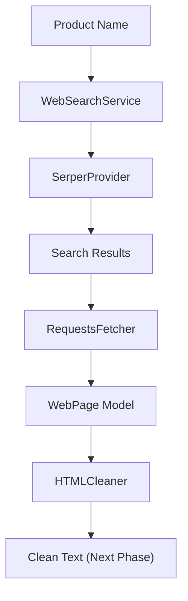
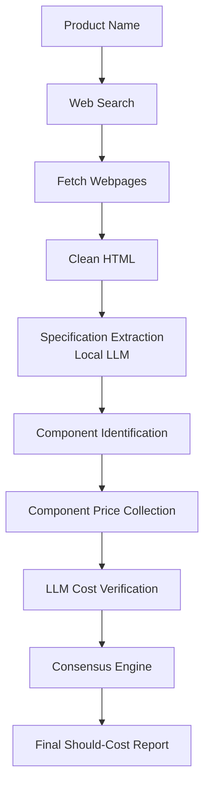

# SQS - Smart Quote System

> **AI-powered Should-Cost Estimation Engine** built using modular services, local LLMs, and evidence-based web extraction.

> **Project Status:** 🚧 Phase 2 (Evidence Collection)

---

# Overview

SQS is an AI-powered backend that estimates the manufacturing cost of electronic products by collecting evidence from the web instead of relying on an LLM's internal knowledge.

The system follows an **evidence-first architecture**:

1. Search for trusted sources.
2. Fetch real webpages.
3. Clean webpage content.
4. Extract structured specifications using local LLMs.
5. Identify hardware components.
6. Estimate component prices from multiple sources.
7. Aggregate estimates using statistical consensus.

The LLM is **never responsible for inventing information**—it only reasons over collected evidence.

---

# Current Architecture



---

# Overall Project Pipeline



---

# Design Philosophy

The project follows a layered architecture.

```
Models
    ↓
Services
    ↓
Pipelines
    ↓
Application
```

Each layer has a single responsibility.

* **Models** represent structured data.
* **Services** perform reusable operations.
* **Pipelines** orchestrate business logic.
* **Application** exposes APIs/UI.

---

# Repository Structure

```text
backend/
│
├── models/
│   ├── component.py
│   ├── llm_response.py
│   ├── product.py
│   ├── product_specifications.py
│   ├── search_result.py
│   └── web_page.py
│
├── services/
│   ├── llm_service.py
│   ├── exceptions.py
│   │
│   ├── search/
│   │   ├── web_search_service.py
│   │   └── providers/
│   │       ├── base_provider.py
│   │       ├── serper_provider.py
│   │       ├── tavily_provider.py
│   │       └── brave_provider.py
│   │
│   ├── fetch/
│   │   ├── page_fetch_service.py
│   │   └── fetchers/
│   │       ├── base_fetcher.py
│   │       └── requests_fetcher.py
│   │
│   └── cleaner/
│       └── html_cleaner.py
│
└── tests/
```

---

# Current Workflow

## 1. Product Search

The search layer accepts a product name and retrieves relevant webpages.

```
Product Name
      ↓
WebSearchService
      ↓
Search Provider
      ↓
SearchResult[]
```

Supported architecture:

* Serper
* Tavily *(planned)*
* Brave *(planned)*

---

## 2. Webpage Fetching

Each search result is downloaded as raw HTML.

```
SearchResult
      ↓
RequestsFetcher
      ↓
WebPage
```

The original HTML is preserved for future processing.

---

## 3. HTML Cleaning *(In Progress)*

Raw webpages are cleaned before being sent to the LLM.

The cleaner removes:

* JavaScript
* CSS
* Hidden elements
* HTML tags
* Excess whitespace

Result:

```
Raw HTML
      ↓
HTMLCleaner
      ↓
Clean Text
```

---

# Local LLMs

The project is designed around locally hosted language models.

Current development targets include:

* Qwen 3 8B
* DeepSeek R1 Distill
* GLM 4.5 Air

The LLMs are responsible for:

* extracting specifications
* identifying components
* verifying extracted prices

They **do not search the web** or generate unsupported facts.

---

# Core Principles

## Evidence First

Every estimation must originate from collected evidence.

```
Search
    ↓
Fetch
    ↓
Clean
    ↓
LLM
```

---

## Modular Services

Each service performs exactly one task.

```
Search

Fetch

Clean

Extract

Price

Consensus
```

---

## Provider Abstraction

External integrations are abstracted.

```
WebSearchService
        │
        ├── Serper
        ├── Tavily
        └── Brave
```

The application never depends directly on a provider implementation.

---

## Local AI

No cloud LLM APIs are required.

The system is designed to run completely offline after evidence collection.

---

# Roadmap

## ✅ Phase 1

* Project architecture
* Domain models
* LM Studio integration
* Search provider abstraction
* Serper integration
* Web search service
* Page fetching

---

## 🚧 Phase 2

* HTML cleaner
* Content trimming
* Page processing

---

## 📅 Phase 3

* Specification extraction
* Structured outputs
* Product specification models

---

## 📅 Phase 4

* Component identification
* Hardware decomposition

---

## 📅 Phase 5

* Component price discovery
* Multi-source evidence collection

---

## 📅 Phase 6

* Multi-LLM verification
* DBSCAN consensus
* Outlier removal

---

## 📅 Phase 7

* SQLite storage
* Excel export
* REST API
* Frontend integration

---

# Long-Term Vision

The goal is to build a fully explainable AI system capable of generating manufacturing should-cost estimates using:

* Evidence-driven reasoning
* Local open-source language models
* Modular architecture
* Statistical validation
* Transparent cost attribution

Rather than asking an LLM for costs, SQS constructs a verifiable evidence pipeline and produces cost estimates supported by multiple independent sources.
